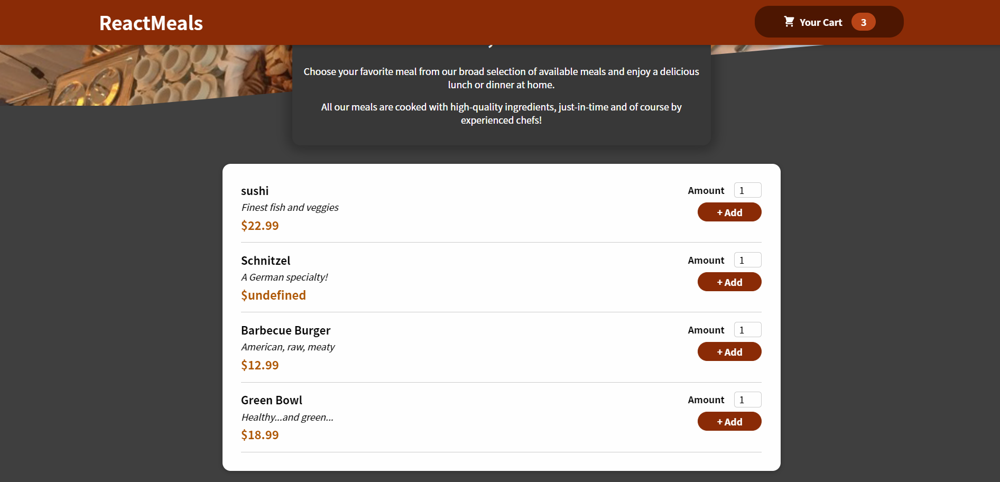
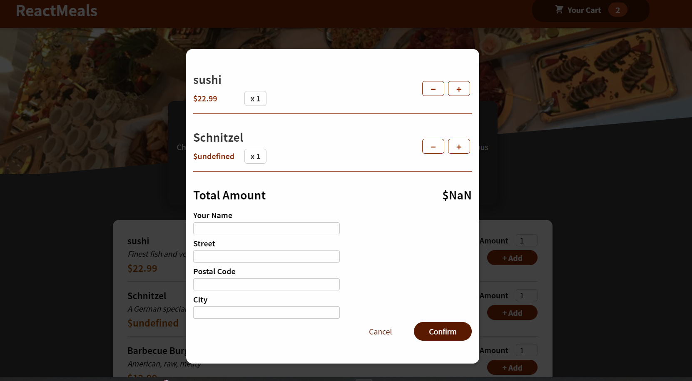

# react-meals

a simple food app developed with react where the user can update and delete items from their cart. 

## features included 

- Add to cart functionality
- Shopping cart functionality
- Product Filtering functionality
- Product page
- Cart and checkout page


### Technologies Used:

---

1. React.js
2. Redux Toolkit
3. ReactStrap
4. CSS
5. Firebase

### How to start?

---

## To start  project 

```javascript
// first install all necessary dependencies

npm i

// next run

npm start

```




## Erik P. Williams